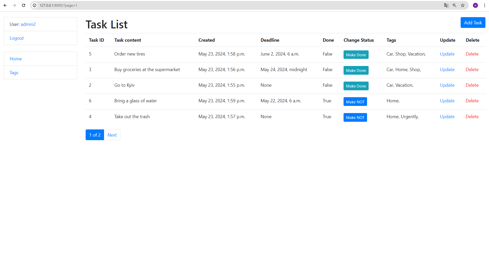

# todo_list 

The project was created to manage user tasks. You can create a list of your tasks in the system. 
A tag or tags are also assigned to the task.

## Installing / Getting started

Python3 must be already installed

```shell
git clone https://github.com/Anton-Konyk/todo_list
cd todo_list
Python3 -n venv venv
source venv/bin/activate (for MacOS/Linux) and venv/scripts/activate (for Windows)
pip install -r requirenents.txt
python manage.py runserver
```


## Features

* Authentication functionality for User
* Managing (add, update, delete, set and change status, deadline time, applying Tags) Tasks using website interface 
* Managing Tags (add, update, delete) directly from website interface
* Powerful admin panel for advanced management


## Contributing

It's open source code.
If you'd like to contribute, please fork the repository and use a feature
branch. Pull requests are warmly welcome.


## Demo



